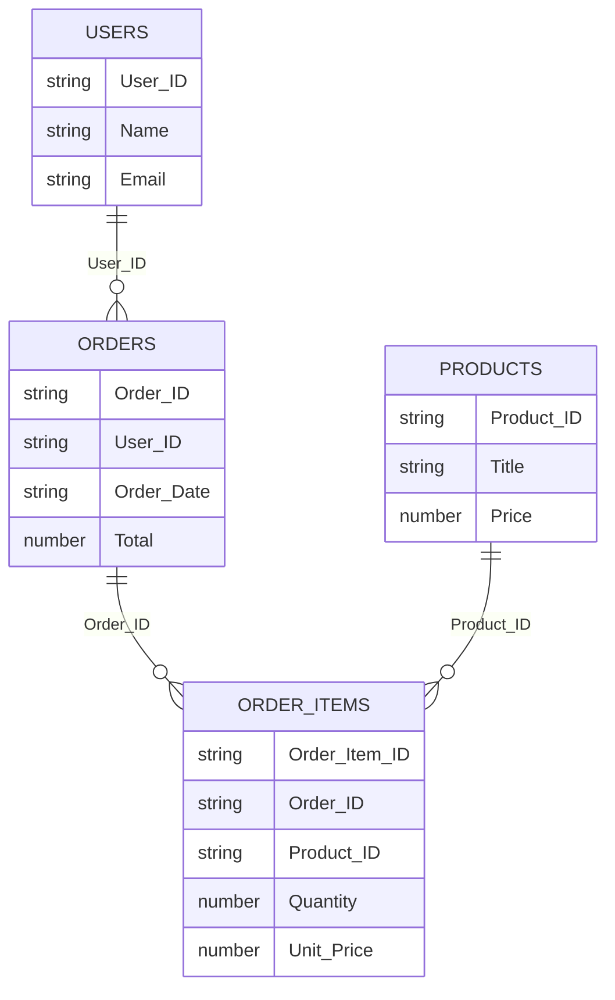

# ERD: Users, Products, Orders

```mermaid
erDiagram
    USERS {
        string User_ID
        string Name
        string Email
    }

    PRODUCTS {
        string Product_ID
        string Title
        number Price
    }

    ORDERS {
        string Order_ID
        string User_ID
        string Order_Date
        number Total
    }

    ORDER_ITEMS {
        string Order_Item_ID
        string Order_ID
        string Product_ID
        number Quantity
        number Unit_Price
    }

    USERS ||--o{ ORDERS : "User_ID"
    ORDERS ||--o{ ORDER_ITEMS : "Order_ID"
    PRODUCTS ||--o{ ORDER_ITEMS : "Product_ID"
```
