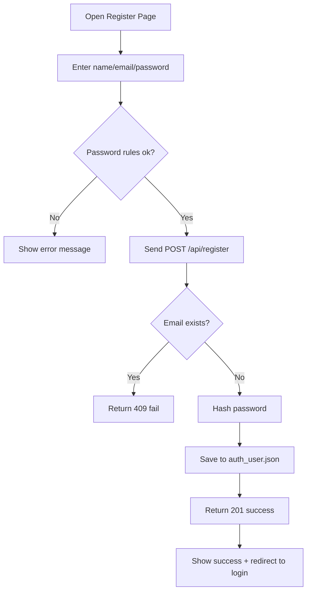
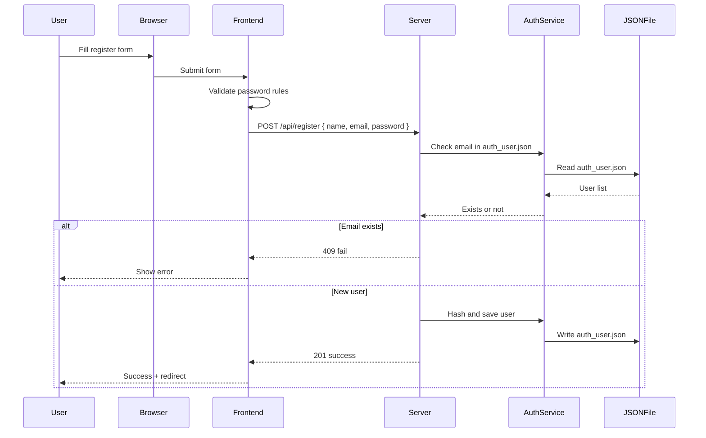

# Registration Assignment

## 1) Contract Table

| Item | Description |
| --- | --- |
| Trigger | User opens Register page and submits form |
| Endpoint | `POST /api/register` |
| Request Body (Envelope) | `{ name, email, password }` |
| Frontend Gatekeeper | Password >= 8 chars, >= 1 uppercase, >= 1 special (!@#$%^&*) |
| Backend Gatekeeper | Reject if username (email) already exists in auth_user.json |
| Success Status | `status: "success"` (201) |
| Fail Status | `status: "fail"` (400/409/500) |
| Success Package | `{ status, message }` |
| Fail Package | `{ status, message }` |

### auth_user.json Schema

| Field | Type | Example |
| --- | --- | --- |
| id | string | `au-1714900000000` |
| name | string | `Nina Wood` |
| username | string | `nina.wood@example.com` |
| password | string | `bcrypt-hash` |
| createdAt | string | `2026-05-05` |

## 2) Activity Diagram (Registration)

## 3) Sequence Diagram (Registration)

## 4) GenAI Prompt (Contract + Diagrams)

"""
You are a full-stack assistant. Implement user registration.
Backend: Express POST /api/register. Expect JSON body { name, email, password }.
Check if email already exists in auth_user.json. If exists, return 409 with
{ status: "fail", message }.
If new, hash password with bcrypt and store user in auth_user.json.
Return 201 { status: "success", message }.

Frontend: register.js should validate password rules before sending:
- at least 8 characters
- at least 1 uppercase
- at least 1 special character (!@#$%^&*)
Show clear error messages and redirect to login on success.
Add brief comments explaining the flow in both route and register.js.
"""
