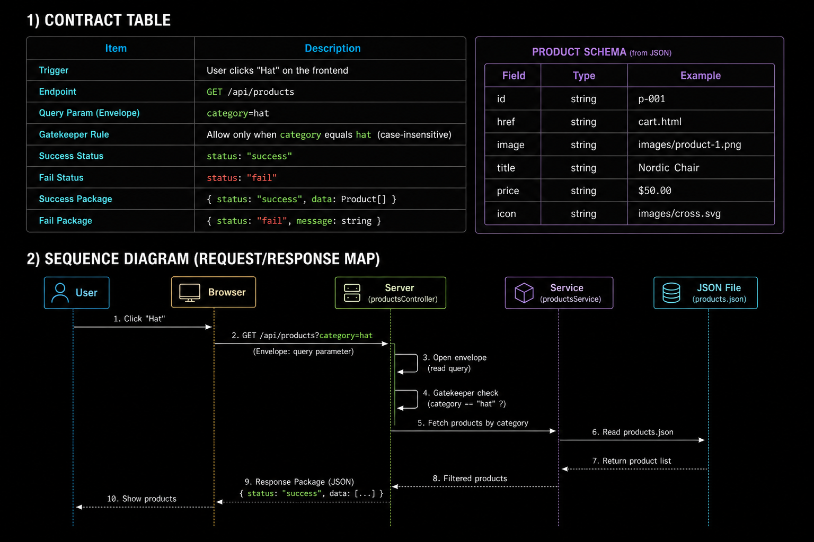
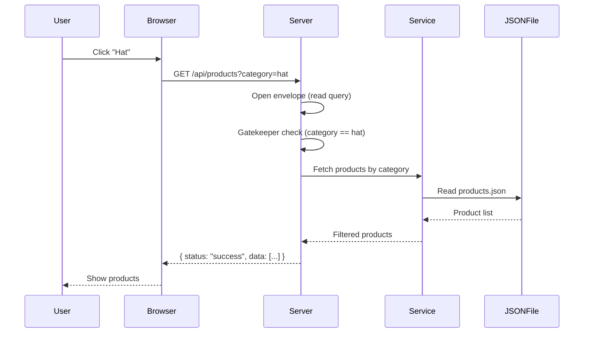

# Weekend Work (5 points)

## 1) Contract Table

| Item | Description |
| --- | --- |
| Trigger | User clicks "Hat" on the frontend |
| Endpoint | `GET /api/products` |
| Query Param (Envelope) | `category=hat` |
| Gatekeeper Rule | Allow only when `category` equals `hat` (case-insensitive) |
| Success Status | `status: "success"` |
| Fail Status | `status: "fail"` |
| Success Package | `{ status, data: Product[] }` |
| Fail Package | `{ status, message }` |

### Product Schema (from JSON)

| Field | Type | Example |
| --- | --- | --- |
| id | string | `p-001` |
| href | string | `cart.html` |
| image | string | `images/product-1.png` |
| title | string | `Nordic Chair` |
| price | string | `$50.00` |
| icon | string | `images/cross.svg` |

## 2) Sequence Diagram (Request/Response Map)

## 3) GenAI Prompt (from Contract + Sequence)

"""
You are a backend assistant. Build an Express route for GET /api/products.
The request envelope includes a query parameter: category.
Implement gatekeeper logic: allow only when category equals "hat" (case-insensitive).
On success, read local products.json, filter products by category (match in title),
and respond with JSON { status: "success", data: Product[] }.
On failure (gatekeeper or server error), respond with JSON { status: "fail", message }.
Add brief comments in code explaining envelope, gatekeeper, and package.
"""
